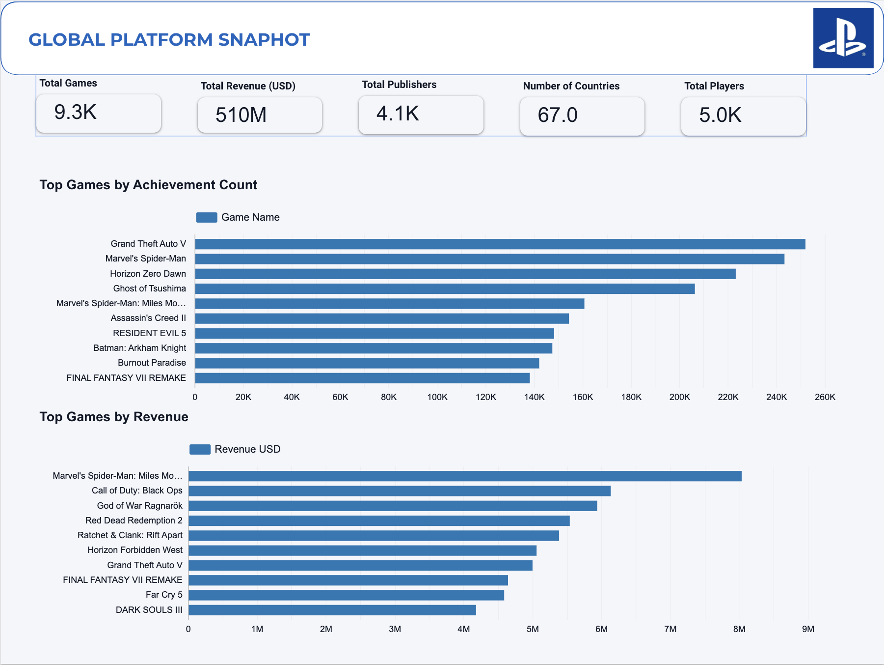
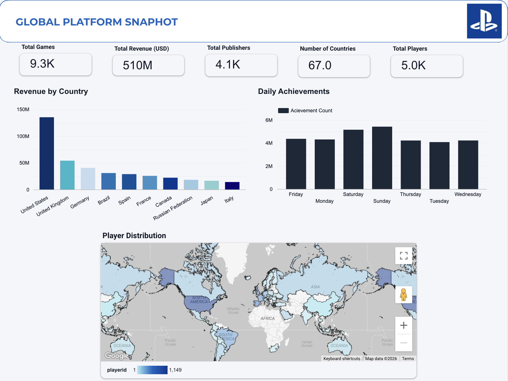
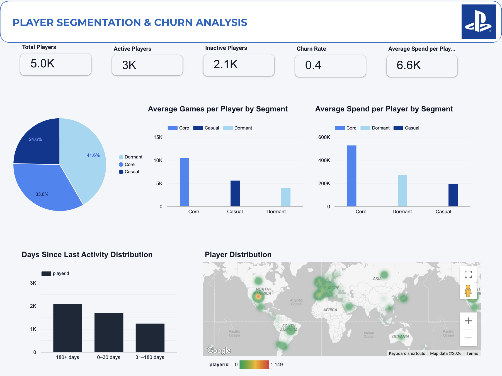
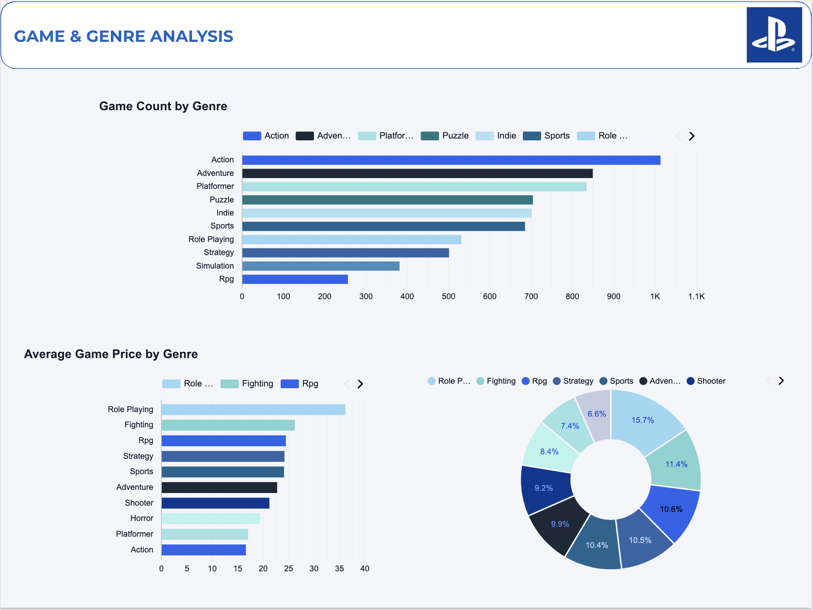
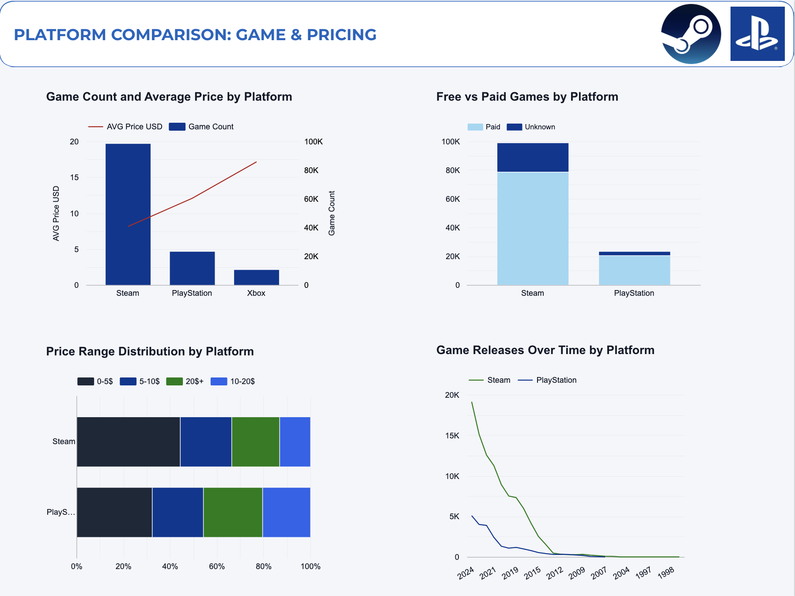
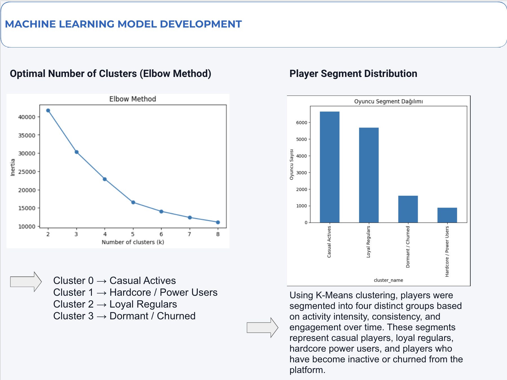
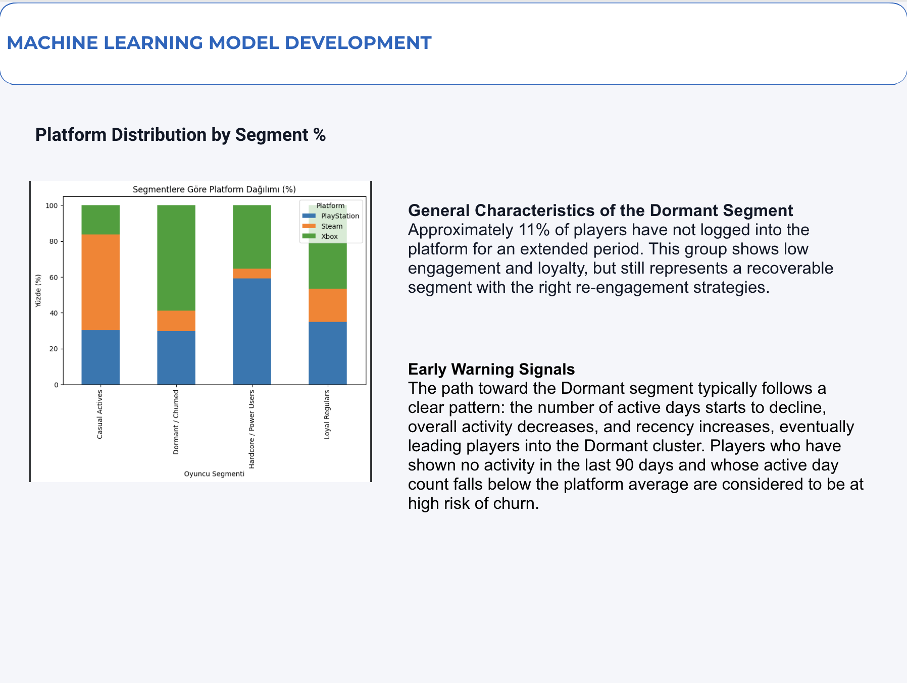
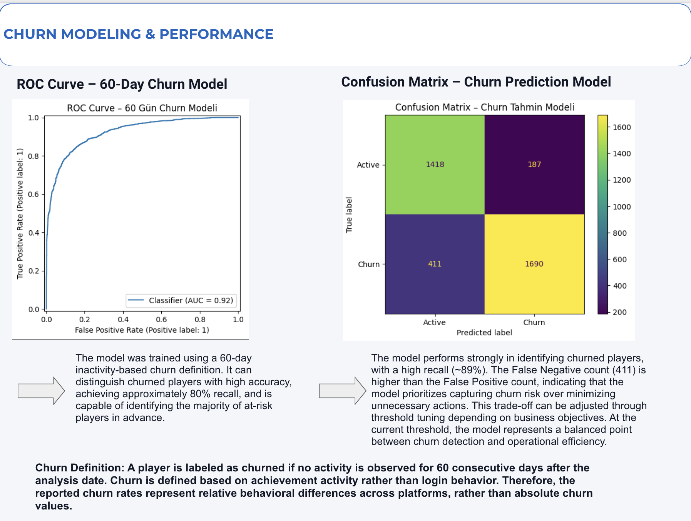
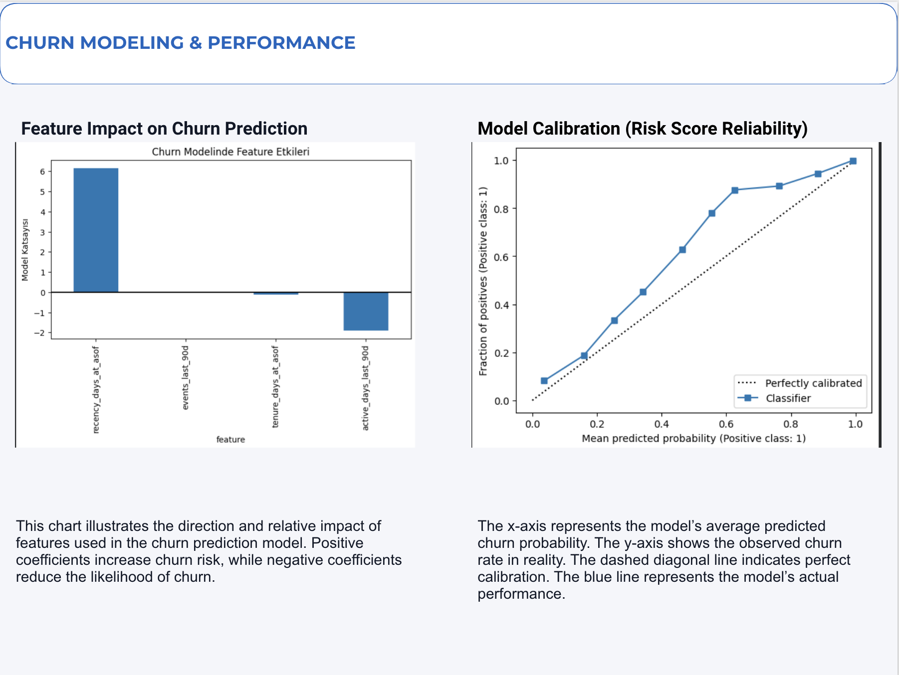

# Gaming Profile Analytics & Churn Modeling (End-to-End)

This project delivers an end-to-end **Gaming Analytics + Machine Learning** solution focused on player behavior analysis, segmentation, and churn prediction.
The workflow combines data exploration, interactive dashboards, and ML-driven churn modeling to support data-informed product and growth decisions.

---

## Project Scope

- Global platform analytics (games, players, revenue, publishers)
- Player segmentation and lifecycle analysis
- Genre, pricing, and platform comparisons
- Dormant player behavior analysis
- Churn prediction using machine learning
- Model performance evaluation and calibration

---

## Dashboard Pages & Visual Assets

### 01. Global Platform Snapshot
High-level overview of the gaming ecosystem including total games, revenue, publishers, players, and country coverage.

- Core KPIs: total games, total revenue, publishers, players, countries
- Snapshot-level strategic overview

**File:** `01_global_platform_snapshot.png`

---

### 02. Global Platform Snapshot – Detailed View
Deeper exploration of global performance metrics with country-level and temporal breakdowns.

- Revenue by country
- Daily achievement activity trends
- Geographic player distribution

**File:** `02_global_platform_snapshot_detail.png`

---

### 03. Player Segmentation & Churn Analysis
Overview of player base composition and engagement patterns.

- Active vs inactive players
- Churn rate overview
- Spend and activity distribution by segment

**File:** `03_player_segmentation_churn_analysis.png`

---

### 04. Game & Revenue Analysis
Revenue and engagement performance across top-performing games.

- Top games by revenue
- Top games by engagement
- Revenue distribution across genres

**File:** `04_game_revenue_analysis.png`

---

### 05. Game & Genre Analysis
Distribution and pricing dynamics across game genres.

- Game count by genre
- Average game price by genre
- Genre-level composition

**File:** `05_game_genre_analysis.png`

---

### 06. Platform Comparison – Game & Pricing
Comparative analysis of Steam, PlayStation, and Xbox ecosystems.

- Game count vs average price by platform
- Free vs paid game distribution
- Price range distribution
- Game release trends over time

**File:** `06_platform_comparison_game_pricing.png`

---

### 07. Player Segmentation (Machine Learning)
K-Means clustering applied to player behavior metrics.

- Optimal cluster selection (Elbow Method)
- Behavioral segmentation of players
- Casual, loyal, hardcore, and dormant segments

**File:** `07_player_segmentation_ml.png`

---

### 08. Dormant Segment Analysis
In-depth analysis of inactive and at-risk players.

- Platform distribution by segment
- Early warning signals of churn
- Re-engagement opportunity insights

**File:** `08_dormant_segment_analysis.png`

---

### 09. Churn Modeling & Performance
Evaluation of the churn prediction model.

- ROC Curve (60-day churn definition)
- Confusion Matrix
- Recall-focused churn detection strategy

**File:** `09_churn_model_performance.png`

---

### 10. Churn Feature Impact & Calibration
Interpretability and reliability assessment of the churn model.

- Feature impact on churn prediction
- Risk score calibration
- Model reliability across probability bands

**File:** `10_churn_feature_impact_calibration.png`

---

## Machine Learning Overview

- **Segmentation:** K-Means clustering on player activity and engagement metrics
- **Churn Definition:** Player classified as churned if inactive for 60 consecutive days
- **Model Type:** Binary classification (churn vs active)
- **Evaluation Metrics:** ROC-AUC, Recall, Confusion Matrix
- **Goal:** Early identification of at-risk players to support retention strategies

---

## Repository Structure

